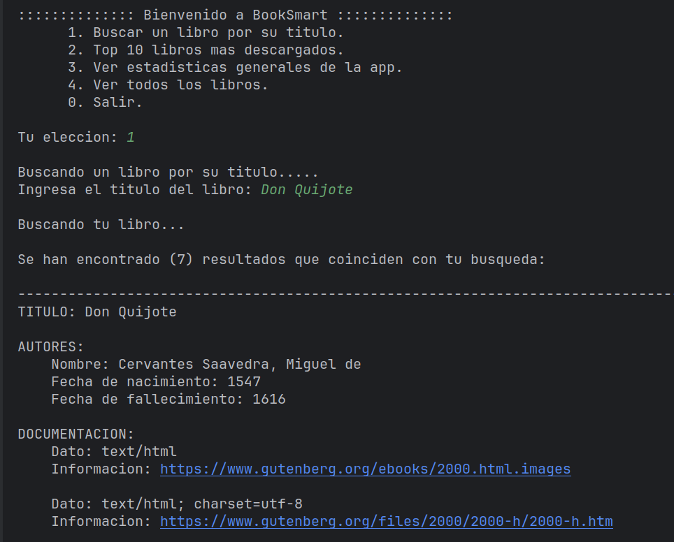
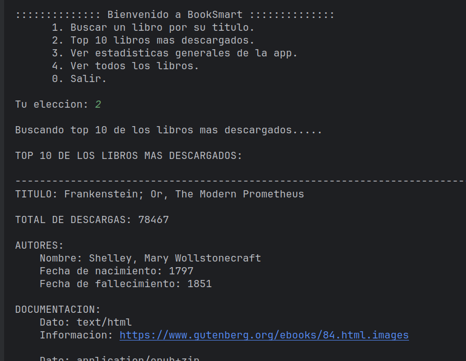
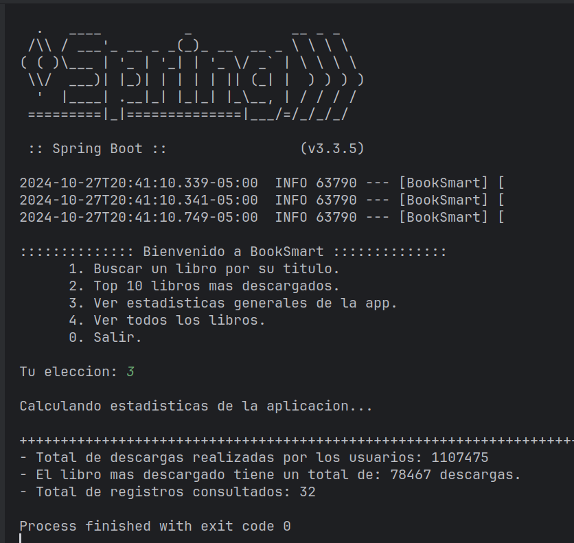

# BookSmart

## Descripcion:
Esta aplicación, desarrollada en Java con Spring Boot, permite la 
búsqueda y gestión de libros mediante el consumo de la API de
https://gutendex.com/.

Entre las funcionalidades que ofrece se incluyen: la búsqueda de 
libros por título, la visualización de los 10 libros más descargados, 
el acceso a estadísticas generales de la aplicación y la posibilidad 
de explorar todos los libros disponibles.

El proyecto se ha creado utilizando Spring Initializr y emplea Maven 
como gestor de dependencias. Además, se ha implementado el uso de 
streams para manipular colecciones de datos y se ha aplicado 
programación funcional para asegurar las mejores prácticas en el 
desarrollo.

Este proyecto forma parte de la formación en Spring en Alura.
  

- #### Consultando Top 10 libros mas descargados:

## Objetivos:

#### Creacion de proyectos con Spring Initializr:
- Creacion de un proyecto con Spring Boot, agregando Maven como gestor de
  dependencias, versiones y metadatos.

#### Consumo de la API de Gutendex:
https://gutendex.com/
- Implementación de solicitudes HTTP para interactuar con la API.

#### Estructuras de Datos y Formato JSON:
- Manejo y procesamiento de datos en formato JSON con la biblioteca Gson.

#### Introducción a la Programación Funcional en Java:
- Aplicación de streams para manipular colecciones de datos de manera eficiente.
  

- #### Consultando estadisticas de la app:
